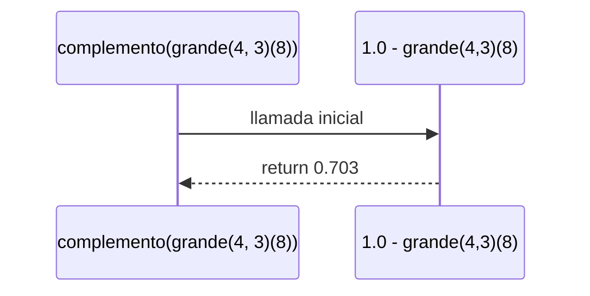

q

# Informe de proceso funcion complemento para conjuntos difusos

## Definición del Algoritmo

```Scala
  def complemento(c: ConjDifuso): ConjDifuso = {

    def complemento1(n:Int): Double ={
      1.0 - c(n)
  }
  complemento1
  //retorna un conjunto difuso complemento del ingresado
}

```

- La función `complemento ` construye un conjunto difuso `complemento1` a partir de un conjunto de entrada `c`.

## Explicación paso a paso

### Paso 1: Llamada inicial

```Scala

  complemento(grande(5,1)) //definimos como parametro de entrada un conjunto grande 
  return complemento1(n) => 1.0 - grande(5,1)(n) 
  //complemento no es una funcion recursiva
  //por lo tanto retorna una funcion que representa el conjunto difuso complemnto

```

## Ejemplo de uso

```Scala
val conjunto = grande(4, 3)
val complemento = complemento(conjunto)
//pertence es una funcion auxiliar para evaluar
//el porcentaje de pertenecia de un elemento al conjunto difuso y complemento
println(pertenece(8,conjunto))  // 0.296...
println(pertenece(8,complemento))  // 0.703....

```

El resultado de `(pertenece(8,complemento)` es `0.703...`.
Esto tiene sentido pues en el conjunto original 8 tenia muchas caracteristicas que reducen su pertenencia al conjunto `conjunto`.

## Diagrama de llamados a la pila


