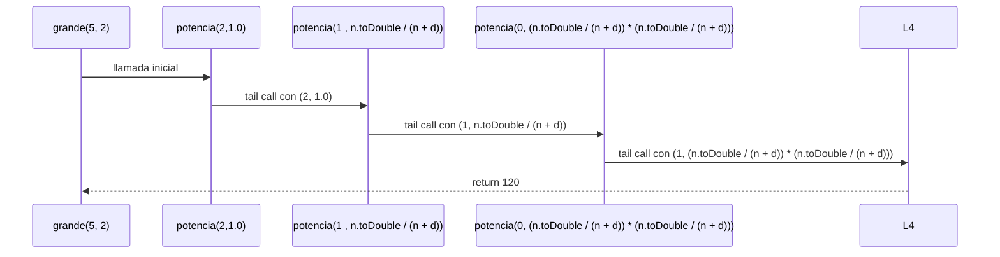

q

# Informe de proceso funcion Grande para conjuntos difusos con potencia por Recursión de Cola

## Definición del Algoritmo

```Scala
    def grande(d: Int, e: Int): ConjDifuso = {
      // d representa qué tan rápido crece la curva
      // e representa qué tan pronunciada es la subida de los porcentajes de pertenencia
      // Se asume e >= 0 para que la potencia esté bien definida
      if (e < 0) {
        throw new IllegalArgumentException("El exponente e debe ser no negativo (e >= 0)")
      }
    
      def funcion(n: Int): Double = {
        if (n + d == 0) {
          // setear a 0.0 ,los casos donde la funcion no esta definida
          0.0
        } else {
          val expresion = n.toDouble / (n + d)
          @tailrec
          def potencia(i: Int, acc: Double): Double = {
            // Calcula (n / (n + d))^e usando recursión de cola
            // n es el valor que se desea evaluar
            i match {
              case 0 => acc
              case _ => potencia(i - 1, acc * expresion)   
            }
          }
          potencia(e, 1.0)
        }
      }
      funcion  // Se retorna la función como un conjunto difuso (Int => Double)
    }

```

- La función `grande ` construye un conjunto difuso `funcion` apartir de dos enteros `d` y `e` utilizando **recursión de cola**.
- La función interna `potencia` es la que hace la recursión:
  - Recibe dos parámetros:
    - `e`: el valor actual decreciente hasta llegar a 0.
    - `acumulador`: donde se guarda el resultado parcial en cada paso.

- El decorador `@annotation.tailrec` obliga a que la función sea optimizada como recursión de cola, es decir, **no se acumulan llamados en la pila**.

## Explicación paso a paso

### Caso base

```Scala
 case 0 => acc
```

Cuando `e` llega a `0`, la función retorna directamente el valor acumulado, evitando llamadas adicionales.

### Caso recursivo

```Scala
case e => potencia (e - 1)(acc * exprecion )
```

En cada llamada:

- Se reduce el valor de `e` en 1.
- Se multiplica el acumulador por la expreción `n.toDouble / (n + d)`, que corresponde a la base del conjunto grande, y se pasa a la siguiente iteración.
- Como es recursión de cola, la llamada recursiva es la **última instrucción** en ejecutarse, lo que permite a Scala optimizar la pila.

---

## Llamados de pila en recursión de cola

Ejemplo:

```Scala
grande(5,2)
```

### Paso 1: Llamada inicial

```Scala
potencia(2)(1.0)
```

### Paso 2: Primera iteración

```Scala
potencia(1)(n.toDouble / (n + d)) // acumulador * n.toDouble / (n + d)
```

### Paso 3: Segunda iteración

```Scala
potencia(0)((n.toDouble / (n + d)) * (n.toDouble / (n + d)) ) // acumulador * n.toDouble / (n + d)
```

### Paso 4: Caso base

```Scala
// Resultado final cuando e=2
//retorna un conjunto difuso que recibe n entero como parametro y retorna un Double
funcion(n) = (n.toDouble / (n + d)) * (n.toDouble / (n + d))
```


## Ejemplo de uso

```Scala
val conjunto = grande(5, 2)
//pertence es una funcion auxiliar para evaluar
//el porcentaje de perdenecia de un elemento al conjunto difuso
println(pertenece(10, conjunto)  // 0.44
```

El resultado de `pretenece(1,grande(5, 5))` es `0.44`.

## Diagrama de llamados de pila con recursión de cola


