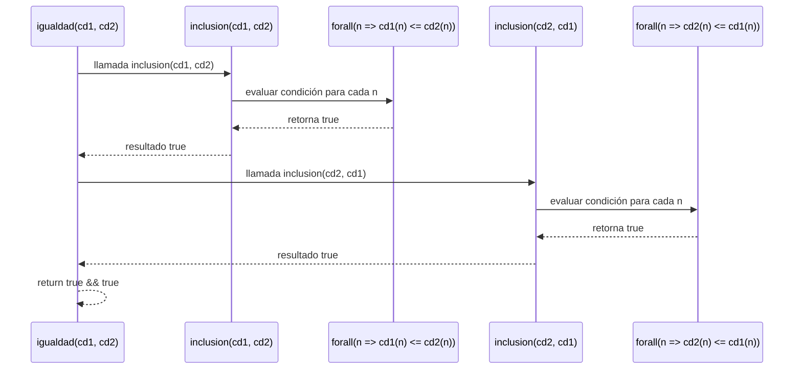

# Informe de proceso — Función `igualdad` con uso de `inclusion`

## Definición del Algoritmo

```scala
def igualdad(cd1: ConjDifuso, cd2: ConjDifuso): Boolean = {
  inclusion(cd1, cd2) && inclusion(cd2, cd1)
}
```

La función `igualdad` determina si dos **conjuntos difusos** son iguales, basándose en la definición matemática:

$$
S_1 = S_2 \iff (S_1 \subseteq S_2) \land (S_2 \subseteq S_1)
$$

En el código, esta igualdad se evalúa aplicando dos veces la función `inclusion`, una en cada dirección.

---

## Definición auxiliar: función `inclusion`

```scala
def inclusion(cd1: ConjDifuso, cd2: ConjDifuso): Boolean = {
  val elements = -10 to 10
  elements.forall(n => cd1(n) <= cd2(n))
}
```

### Descripción

* Se evalúa un rango discreto del universo `U = [-10, 10]`.
* La función de alto orden `forall` verifica que para **todos los elementos** `n`, se cumpla la condición:
  [
  cd1(n) \le cd2(n)
  ]
* Si esto se cumple para todos los elementos, `inclusion` retorna `true`.

---

## Explicación paso a paso

### Paso 1: Llamado inicial a `igualdad`

```scala
igualdad(cd1, cd2)
```

1. Se invoca `inclusion(cd1, cd2)`.
2. Si el resultado es `true`, se invoca `inclusion(cd2, cd1)`.
3. El resultado final será `true` solo si **ambas inclusiones** devuelven `true`.

---

### Paso 2: Ejecución de `inclusion(cd1, cd2)`

Supongamos un universo reducido ( U = {-2, -1, 0, 1, 2} ).

```scala
elements.forall(n => cd1(n) <= cd2(n))
```

* La función `forall` recorre cada `n` aplicando la condición.
* Internamente se comporta de forma recursiva sobre la secuencia, deteniéndose si encuentra un `false`.

#### Pila conceptual de ejecución de `forall`

| Iteración | Elemento `n` | cd1(n) | cd2(n) | Condición cd1(n) ≤ cd2(n) | Resultado parcial |
| --------- | ------------ | ------ | ------ | ------------------------- | ----------------- |
| 1         | -2           | 0.1    | 0.3    | ✅                         | sigue             |
| 2         | -1           | 0.2    | 0.4    | ✅                         | sigue             |
| 3         | 0            | 0.5    | 0.5    | ✅                         | sigue             |
| 4         | 1            | 0.7    | 0.9    | ✅                         | sigue             |
| 5         | 2            | 1.0    | 1.0    | ✅                         | fin = true        |

Resultado: `inclusion(cd1, cd2)` → `true`.

---

### Paso 3: Ejecución de `inclusion(cd2, cd1)`

El proceso se repite en la dirección inversa.
Si todos los elementos también cumplen $$( cd2(n) \le cd1(n) )$$ la función retorna `true`.
En este caso, significa que ambos conjuntos son idénticos.

---

## Comportamiento de pila de llamadas

Aunque el cuerpo de `igualdad` no tiene recursión explícita, la función `inclusion` usa internamente una **recursión funcional** a través de `forall`, que se ejecuta con **recursión de cola** sobre la lista de elementos.

---

## Simulación de llamadas

```scala
igualdad(cd1, cd2)
  -> inclusion(cd1, cd2)
       -> forall(-10 to 10)(n => cd1(n) <= cd2(n))
          -> true
  -> inclusion(cd2, cd1)
       -> forall(-10 to 10)(n => cd2(n) <= cd1(n))
          -> true
  -> true && true
  -> return true
```

---

## Diagrama de flujo de llamadas



---

## Conclusión

* `igualdad` **no es recursiva**, pero **depende de** la función `inclusion`, que usa una **función de alto orden** (`forall`) equivalente a una recursión de cola optimizada.
* No se acumulan llamadas innecesarias en la pila.
* El proceso es completamente funcional:

   * Sin variables mutables.
   * Sin bucles `for` o `while`.
   * Sin `return` explícitos.

Por tanto, el algoritmo cumple con los principios de **programación funcional pura** y mantiene la eficiencia de ejecución.
