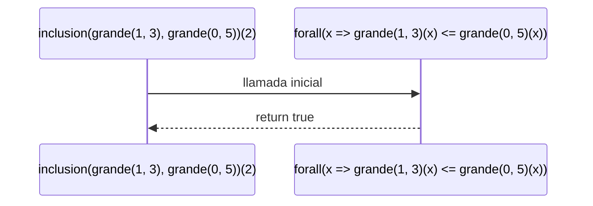

# Informe de proceso función inclusion para conjuntos difusos

## Definición del Algoritmo

```Scala
def inclusion(cd1: ConjDifuso, cd2: ConjDifuso): Boolean= {
    val elements = -10 to 10 // Rango de prueba
    elements.forall(n => cd1(n) <= cd2(n))
}

```
* La función`inclusion` determina si un conjunto difuso `cd1` está incluido en otro conjunto difuso `cd2`. Esto se logra verificando que el grado de pertenencia de cada elemento en `cd1` sea menor o igual al grado de pertenencia del mismo elemento en `cd2` para un rango de valores.
## Explicación paso a paso
### Paso 1: Llamada inicial
```Scala
inclusion(grande(1, 3),grande(0,5))//Definimos dos conjuntos difusos grande como parámetros
//La función evalúa si para todo x en -10 a 10, grande(1,3)(x) <= grande(0, 5)(x)
//No es recursiva, retorna true si la condición se cumple para todos los elementos
```
### Ejemplo de uso
```Scala
val cd1 = grande(1, 3) // Conjunto difuso con rango [1, 3]
val cd2 = grande(0, 5) // Conjunto difuso con rango [0, 5]
val resultado = inclusion(cd1, cd2)
// Usamos pertenence como función auxiliar para evaluar grados de pertenencia
println(pertence(2, cd1))  // 0.5
println(pertence(2, cd2))  // 0.666...
println(resultado)         // true
```
El resultado de ``` inclusion(cd1,cd2``` es ``` true```. Esto tiene sentido porque el conjunto ``` cd1 ``` (con rango [1, 3]) está completamente incluido en el conjunto ``` cd2 ```(con rango [0, 5]), ya que los grados de pertenencia de ``` cd1 ```nunca exceden los de ``` cd2 ``` en el rango evaluado.
## Diagrama de llamados de pila con recursión de cola


