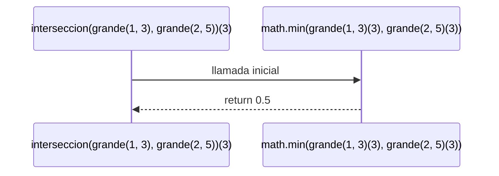

# Informe de proceso función interseccion para conjuntos difusos

## Definición del Algoritmo

```Scala
def union(cd1: ConjDifuso, cd2: ConjDifuso): ConjDifuso = {
   n => math.min(cd1(n), cd2(n))
}
```
La función`interseccion`   crea un nuevo conjunto difuso que representa la intersección de dos conjuntos difusos `cd1` y `cd2`. Esto se logra tomando el mínimo grado de pertenencia entre los valores de `cd1` y `cd2`para cada elemento `n`.
## Explicación paso a paso
### Paso 1: Llamada inicial
```Scala
interseccion(grande(1,3),grande(2,5))//Definimos dos conjuntos difusos grande como parámetros
//La función evalúa para cada n: math.min(grande(1, 3)(n), grande(2, 5)(n))
//No es recursiva, retorna una función que representa la intersección de los conjuntoss
```
### Ejemplo de uso
```Scala
val cd1 = grande(1,3)// Conjunto difuso con rango [1, 3]
val cd2 = grande(2,5)// Conjunto difuso con rango [2, 5]
val interseccionConj = interseccion(cd1, cd2)
// Usamos pertenence como función auxiliar para evaluar grados de pertenencia
println(pertence(1, interseccionConj))  // 0.0 (mínimo entre 0.0 y 0.0)
println(pertence(2, interseccionConj))  // 0.0 (mínimo entre 0.5 y 0.0)
println(pertence(3, interseccionConj))  // 0.5 (mínimo entre 1.0 y 0.5)
println(pertence(4, interseccionConj))  // 0.25 (mínimo entre 1.0 y 0.75)
```
El resultado de ``` pertenece(4,interseccionConj``` es ``` 0.5```. Esto tiene sentido porque el mínimo grado de pertenencia entre ``` cd1 ``` y ``` cd2 ``` en el punto 3 es 0.5, reflejando la intersección que toma el menor valor de pertenencia en cada punto.
## Diagrama de llamados de pila con recursión de cola

El diagrama muestra cómo la función `interseccion` calcula el mínimo entre los grados de pertenencia de `cd1` y `cd2` para un elemento dado (en este caso 3), retornando el resultado.