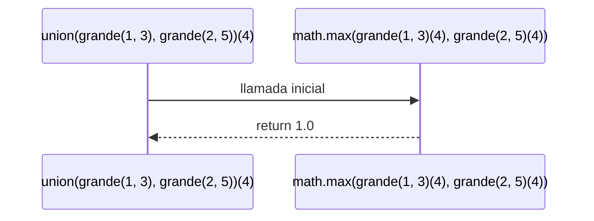

# Informe de proceso función union para conjuntos difusos

## Definición del Algoritmo

```Scala
def union(cd1: ConjDifuso, cd2: ConjDifuso): ConjDifuso = {
  n => math.max(cd1(n), cd2(n))
}

```
* La función`union`  crea un nuevo conjunto difuso que representa la unión de dos conjuntos difusos `cd1` y `cd2`. Esto se logra tomando el máximo grado de pertenencia entre los valores de `cd1` y `cd2`para cada elemento `n`.
## Explicación paso a paso
### Paso 1: Llamada inicial
```Scala
union(grande(1,3),grande(2,5))//Definimos dos conjuntos difusos grande como parámetros
//La función evalúa para cada n: math.max(grande(1,3)(n), grande(2,5)(n))
// No es recursiva, retorna una función que representa la unión de los conjuntos
```
### Ejemplo de uso
```Scala
val cd1 = grande(1,3)// Conjunto difuso con rango [1, 3]
val cd2 = grande(2,5)// Conjunto difuso con rango [2, 5]
val unionConj = union(cd1, cd2)
// Usamos pertenence como función auxiliar para evaluar grados de pertenencia
println(pertence(1, unionConj))  // 0.0 (máximo entre 0.0 y 0.0)
println(pertence(2, unionConj))  // 0.5 (máximo entre 0.5 y 0.0)
println(pertence(4, unionConj))  // 1.0 (máximo entre 1.0 y 0.75)
println(pertence(6, unionConj))  // 0.75 (máximo entre 0.0 y 0.75)
```
El resultado de ``` pertenece(4,unionConj``` es ``` 1.0```. Esto tiene sentido porque el máximo grado de pertenencia entre ``` cd1 ``` y ``` cd2 ``` en el punto 4 es 1.0, reflejando la unión que toma el mayor valor de pertenencia en cada punto.
## Diagrama de llamados de pila con recursión de cola

* El diagrama muestra cómo la función `union` calcula el máximo entre los grados de pertenencia de `cd1` y `cd2` para un elemento dado (en este caso 4), retornando el resultado.